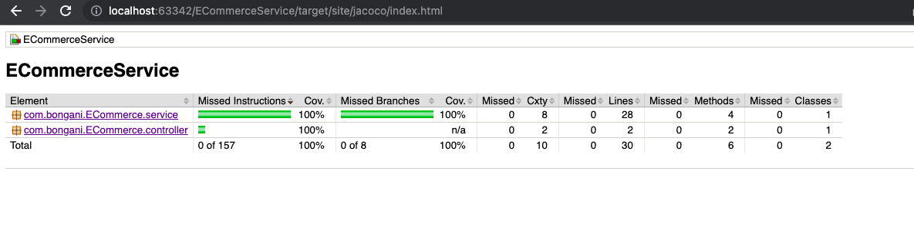

Table of Contents
=================

* [Ecommerce Service](#ecommerce-Service)
    * [Minimum Requirements](#minimum-requirements)
* [Getting Started](#getting-started)
    * [Major Libraries / Tools](#major-libraries--tools)
    * [Checkout the Code](#checkout-the-code)
* [Setting up Prerequisites](#setting-up-prerequisites)
    * [Maven setup](#maven-setup)
    * [Run service](#run-service)
* [Running Quality Gates and Deployment Commands](#running-quality-gates-and-deployment-commands)
    * [Check Style](#checkstyle)
    * [Unit Tests](#unit-tests)
    * [Code Coverage](#code-coverage)
* [TODO](#todo)

# Ecommerce Service
E-Commerce application is a simplified RestFul API with a single endpoint that performs a checkout action.

## Minimum Requirements
- Install git (if you don't hav it yet) https://www.atlassian.com/git/tutorials/install-git
- Java version 18 (used for this project is v18) https://www.oracle.com/java/technologies/downloads/

# Getting Started
This project (Maven) was bootstrapped with [Spring initializr](https://start.spring.io/).

- If you are not already familiar with building for Spring-Boot you may start with this tutorial :
  You can learn more in the [Spring-Boot documentation](https://docs.spring.io/spring-boot/docs/current/reference/htmlsingle/).

## Major Libraries / Tools

| Category                        	  | Library/Tool   	         | Link                                                       	           |
|------------------------------------|--------------------------|------------------------------------------------------------------------|
| Maven (wrapper)                    | MVN                      | https://maven.apache.org/
| Unit Testing                       | Spring Boot Starter Test | Test integrated with Spring Boot Starter           	                   |
| Code Coverage                      | JaCoCo                   | https://www.jacoco.org/                                                |
| Static Code Check                  | CheckStyle               | https://checkstyle.sourceforge.io/                                     |
| Integration Testing              	 | Mockito         	        | Integrated with Spring Boot Framework                                	 |                                     	           |

## Checkout the Code

```bash
git clone git@github.com:bonganim911/eCommerceService.git
cd ECommerceService
```

# Setting up Prerequisites

## Maven setup

Install the following dependencies

- **MVN**: https://maven.apache.org/. OR preferable use the wrapper that comes with spring init.

## Run Service
### `./mvnw spring-boot:run`

Runs the api in the development mode.<br />
Invoke [http://localhost:8080](http://localhost:8080) using [Postman](https://www.postman.com/downloads/) or CURL.

## Check Style
### `./mvnw checkstyle:check`

## Unit Tests
### `./mvnw test`


## Code Coverage
### `./mvnw clean verify`
Build target folder that contains site folder with coverages report.



## TODO
### Dockerized
### SonarQube Analysis
### CI-CD - Build via Github Actions (as an option)
